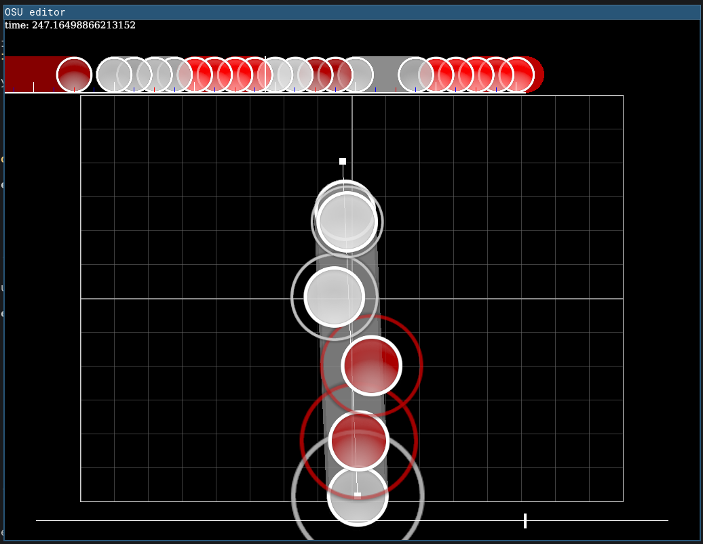

wip osu editor
==============

running on linux
----------------

since the editor requires libbass.so to run, run the wrapper script run.sh instead

running on windows
------------------

wrapper script isn't written yet, in this case i just copied bass.dll to the project root

roadmap
-------

- [ ] long term:
  - [ ] new framework

license
-------

not sure yet, probably gpl

includes code ported from ppy/osu, which is mit-licensed

uses [libosu][1]

[1]: https://github.com/iptq/libosu
